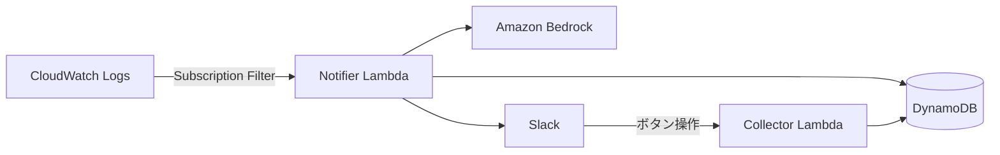

# llm-alert-filter-sample

Amazon Bedrock を使用して CloudWatch Logs のエラーログを評価し、過去のユーザーフィードバック履歴に基づいて Slack 通知の要否を判定するサーバーレスアプリケーションです。

Rust Lambda + AWS CDK (TypeScript) で構成されています。

[English (README.md)](./README.md)

## アーキテクチャ



### コンポーネント

| コンポーネント              | 説明                                                                                                             |
|----------------------|----------------------------------------------------------------------------------------------------------------|
| **Notifier Lambda**  | CloudWatch Logs サブスクリプションフィルタから起動。DynamoDB からフィードバック履歴を取得し、Bedrock Converse API でエラーログを評価、通知が必要な場合は Slack に投稿。 |
| **Collector Lambda** | Axum ベースの HTTP エンドポイント（Function URL）。Slack のボタン操作・モーダル送信からフィードバックを受け取り、DynamoDB に保存。                           |
| **DynamoDB**         | ユーザーフィードバックを保存。`log_group` の GSI で効率的なクエリを実現。                                                                  |
| **Amazon Bedrock**   | フィードバック履歴に基づいてエラーログを評価し、通知要否・確信度・理由を返却。                                                                        |

## 動作の流れ

1. 監視対象の CloudWatch Logs ロググループにエラーログが出力される
2. サブスクリプションフィルタが **Notifier Lambda** を起動
3. Lambda が DynamoDB から該当ロググループの過去のフィードバックを取得
4. Amazon Bedrock がフィードバック履歴に基づいてエラーログを評価し、判定結果（`needs_notification`, `confidence`, `matched_feedback_reason`）を返却
5. 通知が必要と判定された場合（または確信度が高くない場合のフェイルセーフとして）、Slack メッセージを投稿
6. 運用者がアラートを確認し、フィードバックボタンをクリック
7. モーダルが開き、通知の要否と理由を入力
8. **Collector Lambda** がフィードバックを DynamoDB に保存し、以降の評価に活用

## 前提条件

- [Rust](https://www.rust-lang.org/tools/install)
- [cargo-lambda](https://github.com/cargo-lambda/cargo-lambda)
- [Zig](https://ziglang.org/learn/getting-started/)（クロスコンパイル用）
- [AWS CDK](https://docs.aws.amazon.com/ja_jp/cdk/v2/guide/getting_started.html)
- [AWS CLI](https://docs.aws.amazon.com/ja_jp/cli/latest/userguide/getting-started-install.html)（認証情報を設定済みであること）
- [Node.js](https://nodejs.org/) (v22+)
- Amazon Bedrock のモデルアクセス（AWS コンソールからリクエスト）

## クイックスタート

### 1. Slack App の作成とインストール

`slack_app/manifest.json` を使用して Slack App を作成し、ワークスペースにインストールします。
**Bot User OAuth Token** と **Signing Secret** を取得しておきます。

### 2. 対象リージョンの設定

`AWS_DEFAULT_REGION` を export しておくことで、以降の CDK デプロイと AWS CLI コマンドが同じリージョンを対象にします。

```bash
export AWS_DEFAULT_REGION=us-east-1
```

### 3. CDK のデプロイ

```bash
cd cdk
npm ci
npx cdk deploy LlmAlertFilterStack \
  --parameters SlackChannelId="<通知先の Slack チャンネル ID>"
```

デプロイ後、`llm-alert-filter-collector` Lambda の **Function URL** を取得しておきます。

### 4. Secret の値を更新

```bash
aws secretsmanager put-secret-value \
  --secret-id llm-alert-filter-notifier \
  --secret-string '{"SLACK_TOKEN":"<Bot User OAuth Token>"}'

aws secretsmanager put-secret-value \
  --secret-id llm-alert-filter-collector \
  --secret-string '{"SIGNING_SECRET":"<Signing Secret>","SLACK_TOKEN":"<Bot User OAuth Token>"}'
```

### 5. Slack App の Interactivity を有効化

Slack App の **Interactivity** を有効化し、以下のリクエスト URL を設定します。

```
<collector の Function URL>/feedback
```

### 6. 検証

テスト用ロググループ（`llm-alert-filter-test1` または `llm-alert-filter-test2`）に "error" を含むログを送信し、Slack に通知されることを確認します。

## 設定

### CfnParameter

デプロイ時に `--parameters` で指定可能なパラメータ:

| パラメータ            | 型      | デフォルト                        | 説明                                 |
|------------------|--------|------------------------------|------------------------------------|
| `SlackChannelId` | String | (必須)                         | 通知先の Slack チャンネル ID                |
| `BedrockModelId` | String | `us.amazon.nova-2-lite-v1:0` | 推論に使用する Bedrock モデル ID             |
| `AppLanguage`    | String | `en`                         | プロンプトと Slack メッセージの言語（`en` / `ja`） |
| `MaxRetries`     | Number | `3`                          | Bedrock API の最大リトライ回数（0-6）         |
| `BaseDelayMs`    | Number | `500`                        | 指数バックオフの基本待機時間 ms（100-10000）       |

### 環境変数

CDK によって自動設定される環境変数（参考情報）:

| 変数名                | Lambda   | 説明                      |
|--------------------|----------|-------------------------|
| `TABLE_NAME`       | 両方       | DynamoDB テーブル名          |
| `BEDROCK_MODEL_ID` | Notifier | Bedrock モデル ID          |
| `APP_LANGUAGE`     | 両方       | 言語設定                    |
| `MAX_RETRIES`      | Notifier | 最大リトライ回数                |
| `BASE_DELAY_MS`    | Notifier | バックオフ基本待機時間             |
| `SLACK_CHANNEL_ID` | 両方       | Slack チャンネル ID          |
| `SECRET_ID`        | 両方       | Secrets Manager シークレット名 |

## テスト

### Rust

```bash
cd lambda
cargo test
cargo clippy
cargo fmt --check
```

### CDK

```bash
cd cdk
npm ci
npm test
npm run check
```

## コスト見積もり

サーバーレス・オンデマンド型のサービスを使用しているため、コストは使用量に応じて発生します。

- **Lambda**: ARM_64、128 MB メモリ。低トラフィックであれば無料枠内。
- **DynamoDB**: PAY_PER_REQUEST 課金。低トラフィックであれば無料枠内。
- **Bedrock**: モデルによりトークン単価が異なる。[Amazon Bedrock 料金](https://aws.amazon.com/jp/bedrock/pricing/) を参照。
- **Secrets Manager**: $0.40/シークレット/月（2026年4月時点。最新料金は [AWS Secrets Manager 料金](https://aws.amazon.com/jp/secrets-manager/pricing/) を参照）。

## ライセンス

[MIT-0](./LICENSE)
