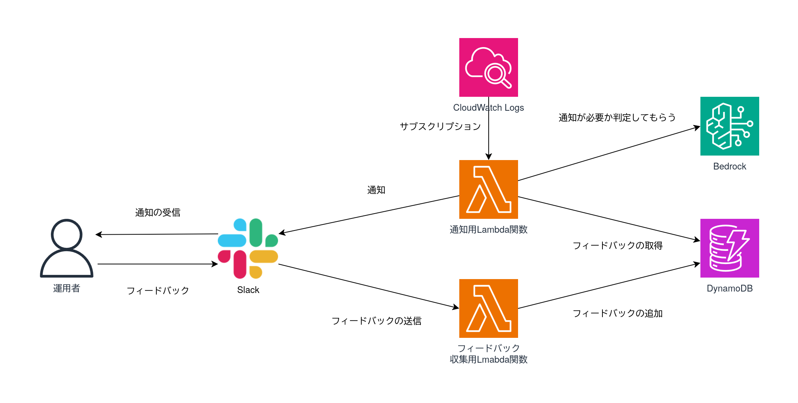

# llm-alert-filter-sample

Bedrockを使用して、エラーログのフィルタリングを行うサンプルです。

## 概要図



## デプロイ方法

以下の手順を実施することで `us-east-1` に以下のリソースがデプロイされます。

- Lambda
- DynamoDB
- CloudWatch Logs
- Secrets Manager

### 1. 事前準備

デプロイには以下のツールが必要です。

- [Rust](https://www.rust-lang.org/tools/install)
- [cargo-lambda](https://github.com/cargo-lambda/cargo-lambda)
- [Zig](https://ziglang.org/learn/getting-started/)
- [CDK](https://docs.aws.amazon.com/ja_jp/cdk/v2/guide/getting_started.html)

また、利用するBedrockのモデルへのリクエスト申請が必要です。
使用するモデルは以下に定義されてます。
https://github.com/takenoko-gohan/llm-alert-filter-sample/blob/main/cdk/lib/llm-alert-filter-stack.ts#L173

### 2. Slack Appの作成とインストール

`slack_app/manifest.json`を使用してSlack Appを作成し、ワークスペースにインストールします。
作成したSlack Appの`Bot User OAuth Token`と`Signing Secret`を取得しておきます。

### 3. CDKのデプロイ

以下のコマンドを実行してデプロイを行います。

```bash
cd cdk
npm install
cdk deploy --parameters SlackChannelId=="<通知したいSlackのチャンネルID>" --parameters SlackToken="<取得したSlack AppのBot User OAuth Token>" --parameters SigningSecret="<取得したSlack AppのSigning Secret>"
```

デプロイ後、作成したLambda関数`llm-alert-filter-collector`のfunction URLを取得しておきます。

### 4. Slack AppのInteractivityを有効化

Slack Appの`Interactivity`を有効化し、以下のリクエストURLを設定します。

```
<llm-alert-filter-collectorのfunction URL>/feedback
```

## 検証方法

通知用Lambda関数にサブスクリプションを設定しているCloudWatch Logs ロググループ`llm-alert-filter-test1`もしくは
`llm-alert-filter-test1`に`error`を含むログを送信することで、Slackに通知されることを確認できます。
