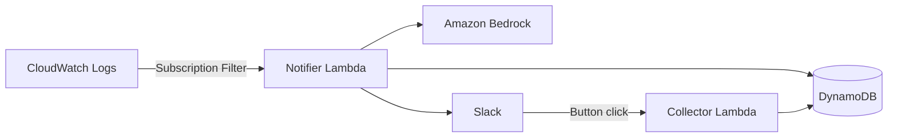

# llm-alert-filter-sample

A serverless application that uses Amazon Bedrock to evaluate CloudWatch Logs error logs and determine whether to send Slack notifications, based on past user feedback history.

Built with Rust Lambda + AWS CDK (TypeScript).

[日本語 (README.ja.md)](./README.ja.md)

## Architecture


```mermaid
flowchart LR
    CW[CloudWatch Logs] -->|Subscription Filter| N[Notifier Lambda]
    N --> DDB[(DynamoDB)]
    N --> BR[Amazon Bedrock]
    N --> Slack
    Slack -->|Button click| C[Collector Lambda]
    C --> DDB
```

### Components

| Component | Description |
|---|---|
| **Notifier Lambda** | Triggered by CloudWatch Logs subscription filters. Retrieves feedback history from DynamoDB, evaluates the error log via Bedrock Converse API, and posts to Slack if notification is needed. |
| **Collector Lambda** | Axum-based HTTP endpoint (Function URL). Receives feedback from Slack button interactions / modal submissions and stores it in DynamoDB. |
| **DynamoDB** | Stores user feedback with a GSI on `log_group` for efficient queries. |
| **Amazon Bedrock** | Evaluates error logs against feedback history to decide notification necessity, confidence level, and reasoning. |

## How It Works

1. An error log appears in a monitored CloudWatch Logs log group
2. The subscription filter triggers the **Notifier Lambda**
3. The Lambda retrieves past feedback for the log group from DynamoDB
4. Amazon Bedrock evaluates the error log against feedback history and returns a decision (`needs_notification`, `confidence`, `matched_feedback_reason`)
5. If the decision is to notify (or confidence is not high as a fail-safe), a Slack message is posted
6. The operator reviews the alert and clicks the feedback button
7. A modal opens for the operator to indicate whether notification was needed and why
8. The **Collector Lambda** stores the feedback in DynamoDB for future evaluations

## Prerequisites

- [Rust](https://www.rust-lang.org/tools/install)
- [cargo-lambda](https://github.com/cargo-lambda/cargo-lambda)
- [Zig](https://ziglang.org/learn/getting-started/) (for cross-compilation)
- [AWS CDK](https://docs.aws.amazon.com/cdk/v2/guide/getting_started.html)
- [Node.js](https://nodejs.org/) (v22+)
- Amazon Bedrock model access (request via AWS Console)

## Quick Start

### 1. Create and Install a Slack App

Use `slack_app/manifest.json` to create a Slack App and install it to your workspace.
Note the **Bot User OAuth Token** and **Signing Secret**.

### 2. Deploy with CDK

```bash
cd cdk
npm ci
npx cdk deploy LlmAlertFilterStack \
  --parameters SlackChannelId="<your-slack-channel-id>"
```

To deploy to a specific region, use one of the following methods:

```bash
# CDK context
npx cdk deploy LlmAlertFilterStack \
  -c region=ap-northeast-1 \
  --parameters SlackChannelId="<your-slack-channel-id>"

# Environment variable
AWS_DEFAULT_REGION=ap-northeast-1 npx cdk deploy LlmAlertFilterStack \
  --parameters SlackChannelId="<your-slack-channel-id>"
```

After deployment, note the **Function URL** of the `llm-alert-filter-collector` Lambda.

### 3. Update Secrets

> **Note:** If your AWS CLI region differs from the deployment region, add `--region <deploy-region>` to each command.

```bash
aws secretsmanager put-secret-value \
  --secret-id llm-alert-filter-notifier \
  --secret-string '{"SLACK_TOKEN":"<Bot User OAuth Token>"}'

aws secretsmanager put-secret-value \
  --secret-id llm-alert-filter-collector \
  --secret-string '{"SIGNING_SECRET":"<Signing Secret>","SLACK_TOKEN":"<Bot User OAuth Token>"}'
```

### 4. Enable Slack App Interactivity

Enable **Interactivity** in your Slack App settings and set the Request URL to:

```
<collector-function-url>/feedback
```

### 5. Verify

Send a log containing "error" to one of the test log groups (`llm-alert-filter-test1` or `llm-alert-filter-test2`) and confirm the Slack notification arrives.

## Configuration

### CfnParameters

Parameters configurable at deployment time via `--parameters`:

| Parameter | Type | Default | Description |
|---|---|---|---|
| `SlackChannelId` | String | (required) | Slack channel ID for notifications |
| `BedrockModelId` | String | `us.amazon.nova-2-lite-v1:0` | Bedrock model ID for inference |
| `AppLanguage` | String | `en` | Language for prompts and Slack messages (`en` / `ja`) |
| `MaxRetries` | Number | `3` | Max retries for Bedrock API calls (0-6) |
| `BaseDelayMs` | Number | `500` | Base delay in ms for exponential backoff (100-10000) |

### Environment Variables

Variables automatically set by CDK (listed for reference):

| Variable | Lambda | Description |
|---|---|---|
| `TABLE_NAME` | Both | DynamoDB table name |
| `BEDROCK_MODEL_ID` | Notifier | Bedrock model ID |
| `APP_LANGUAGE` | Both | Language setting |
| `MAX_RETRIES` | Notifier | Max retry count |
| `BASE_DELAY_MS` | Notifier | Base delay for backoff |
| `SLACK_CHANNEL_ID` | Both | Slack channel ID |
| `SECRET_ID` | Both | Secrets Manager secret name |

## Testing

### Rust

```bash
cd lambda
cargo test
cargo clippy
cargo fmt --check
```

### CDK

```bash
cd cdk
npm ci
npm test
npm run check
```

## Cost Estimate

This application uses serverless and on-demand services, so costs are usage-based:

- **Lambda**: ARM_64, 128 MB memory. Covered by free tier for low-volume use.
- **DynamoDB**: PAY_PER_REQUEST billing. Covered by free tier for low-volume use.
- **Bedrock**: Per-token pricing varies by model. See [Amazon Bedrock Pricing](https://aws.amazon.com/bedrock/pricing/).
- **Secrets Manager**: $0.40/secret/month (as of 2026-04; see [AWS Secrets Manager Pricing](https://aws.amazon.com/secrets-manager/pricing/) for current rates).

## License

[MIT-0](./LICENSE)
